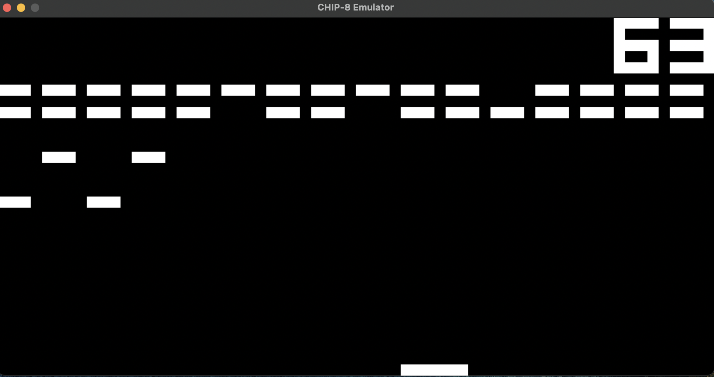
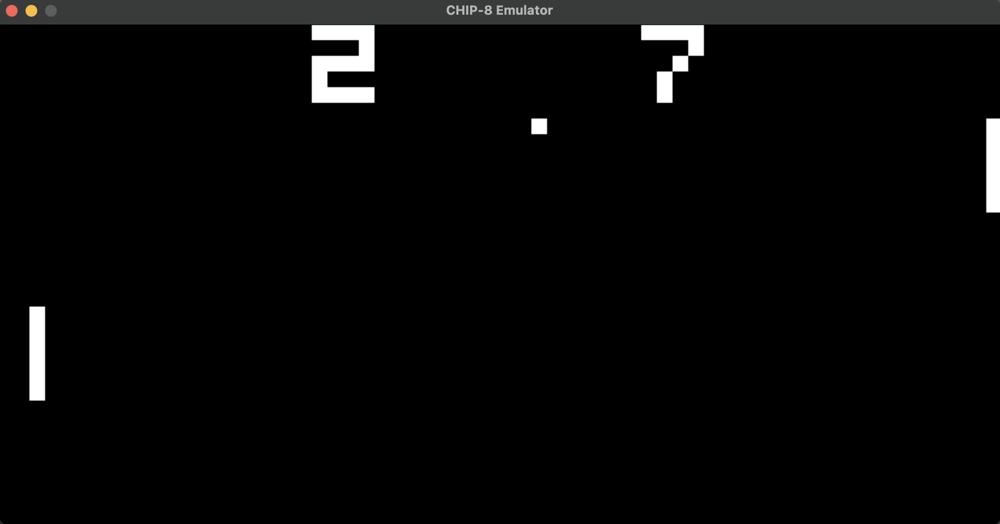

# CHIP-8-Emulator
This is a nearly complete implementation of a CHIP-8 virtual machine but there is currently no sound.


*Brix*


*Pong*


## Compiling and Running

Requires cmake and SDL2 library:
```
$ sudo apt-get install cmake libsdl2-dev
```

Compile:
```
$ make
```

Run:
```
./CHIP8 <ROM file>
```
There are 4 test ROMs included in the `roms` directory.